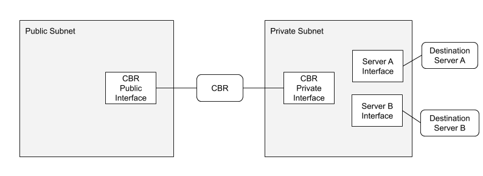

# Linux XDP Content Based Router
 
This repository contains a proof-of-concept Content Based Router (CBR) implemented using [eXpress Data Path (XDP)](https://www.iovisor.org/technology/xdp) in the Linux kernel.
 
This project was part of an Independent Study in Linux Networking at Rose-Hulman Institute of Technology. Its purpose was to develop a practical use case for XDP by creating a content based router with decreased latency between packet ingress and egress when compared to a similar system written in C running in userspace.
 
## Usage
This repository contains the `.c` files for the XDP and userspace programs. It does not contain any code or instructions for compiling these files. A useful set of instructions for setting up an XDP development environment can be found in the [xdp-tutorial respitory](https://github.com/xdp-project/xdp-tutorial). 
 
While this project is no longer in active development, and support may be limited, feel free to submit an issue or pull request and I will try my best to review it.
 
## Theory of Operation
 
A content based router (CBR) examines the payload of an incoming packet and then routes the packet to its intended destination server.
 
### High Level Overview
 
The CBR resides on a server with two network interfaces. One interface is accessible to the public and is used for packet ingress and the other interface is on a private subnet on which the destination servers reside.
 

 
The first step of the CBR is to determine if the ingress packet is one which is intended to be routed. If the protocols and ports are correct, then the CBR begins the routing process.
 
The CBR inspects the payload of the intended protocol and uses it to make a decision on the destination server. The CBR then performs lookups for the addresses of the destination server and modifies the protocol headers as needed such as replacing destination and source fields or recomputing checksums. Finally, the packet egresses the CBR through the interface on the private subnet.
 
### Implementations
 
This XDP CBR has two different implementations: UDP-UDP and TCP-UDP.
 
The UDP-UDP implementation uses IPV4 UDP packets for both ingress and egress. The TCP-UDP implementation uses IPV4 TCP packets for ingress and IPV4 UDP packets for egress.
 
## Artifacts
 
### Environment
 
The `environment` folder contains `ip.sh` which sets up a testing environment for the CBR on a single Linux machine. This testing environment emulates the topology shown above, but alternative environment topologies can be created instead for development or deployment using cloud or physical machines. Documentation for setting up the test environment is detailed in the directory's README.
 
### Kernel
 
The `kernel` folder contains the XDP program code for the UDP-UDP and TCP-UDP implementations found in their respective `udp-udp` and `tcp-udp` subdirectories. Each of these subdirectories also contains a README documenting their implementations and functionality.
 
### User
 
The `user` folder contains `loader.c` for loading the XDP programs onto network interfaces and `map.c` for populating the BPF maps. Documentation for using and modifying the loader and map program is detailed in the directory's README.
 
### Common
 
The `common` folder contains the `cbr.h` header file for the kernel and userspace programs. Documentation detailing this header file is detailed in the directory's README.
 
## Future Work
 
The initial work on this project was limited to two 10 week independent studies and provides only a proof of concept for this XDP use case. 
 
The main impetus behind this project was to find a use for the performance increase provided by XDP. While the project was able to create a novel and practical use case for XDP, its performance improvement was not measured. Future work should include experiments which measure the latency between packet ingress and packet egress and compare this with the latency of similar systems. If the performance is better, this will validate the use case of XDP for content based routing.
 
Additional future work is dependent on the continuing development of XDP features. The TCP-UDP implementation is reliant on the addition of either multiple XDP programs per interface or multiple redirects of the same ingress packet. Until these features are added to XDP, this use case will not be viable.
 
Lastly, support for additional protocols such as IPv6 need to be added in order to increase the compatibility of this content based router.