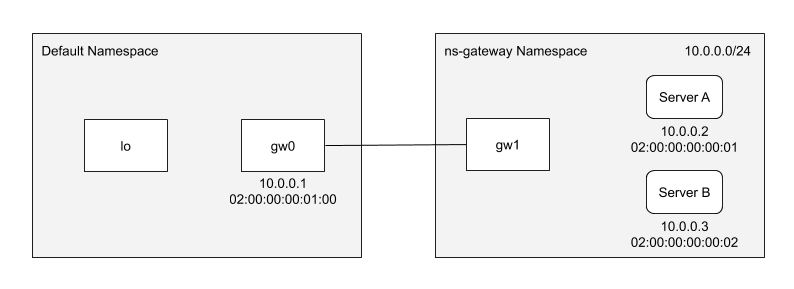

# Environment
 
`setup.sh` contains a setup script for a local Linux testing environment. The script and its use is outlined in this file.
 
## Script Overview
 
The setup script uses [virtual ethernet devices](http://man7.org/linux/man-pages/man4/veth.4.html) to create an environment containing a gateway (hosting the CBR XDP program) and two servers which messages are routed to.
 
The setup script creates the following topology
 

 
`lo` serves as the ingress interface for the gateway and has the CBR XDP program attached. `gw0` serves as the egress interface connected to a private network (the `ns-gateway` network in this case) where the destination servers reside.
 
The destination servers and `gw1` reside on the `10.0.0.0/24` subnet and appropriate ARP and Route entries are set. The servers only exist in these tables and do not have any interfaces in the network.
 
Messages ingress at `lo`, are inspected, routed, and redirected through `gw0` which is linked to `gw1` in the `ns-gateway` namespace. In order to verify that packets are being routed to the correct destination server, a packet sniffing program such as `tshark` can be run in the `ns-gateway` namespace.
 
`ip netns exec ns-gateway tshark`
 
If the environment is set up correctly and the CBR is functioning, `tshark` should see packets being sent from `gw0` at `10.0.0.1` to the correct destination server IP/MAC address combo.
 
## Steps
 
### Environmental Cleanup
 
The script can be run multiple times so the first step is to remove the `ns-gateway` namespace if it exists as well as the `gw0` interface.
 
### Mounting BPF Map
 
The CBR XDP program uses pinned maps and as such the location `/sts/fs/bpf` must be mounted in order to use the maps.
 
### Creating Namespace
 
The script creates the `ns-gateway` namespace.
 
### Adding Gateway Links
 
The script adds veth pair `gw0-gw1` with `gw0` having a MAC address of `02:00:00:00:01:00` and IP of `10.0.0.1` residing in the default namespace and `gw1` residing in the `ns-gateway` namespace.
 
### Enabling Gateway links
 
The script sets `gw0` and `gw1` up.
 
### Adding ARP Entries
 
In order for packets redirected to `gw0` to be sent to the destination servers two ARP entries must be added. Server A has MAC address of `02:00:00:00:00:01` and IP of `10.0.0.2` and Server B has MAC address of `02:00:00:00:00:02` and IP of `10.0.0.3`.
 
### Adding Route Entry
 
In order for packets to be redirected to the `10.0.0.0/24` subnet, a route entry needs to be added to `gw0`.